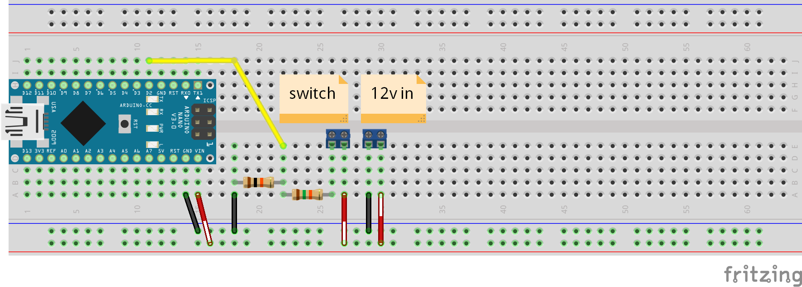

# Doorbell Notifier

Simple module to monitor a single input (pushbutton) and send a message via MQTT.

## Supported modules
- W5100
- ENC28J60

## Installation/Configuration
1. Install [PubSubClient](http://pubsubclient.knolleary.net/), and [AButt](https://github.com/depuits/AButt). Depending on the ethernet module you are using you will also need to install [UIPEthernet](https://github.com/ntruchsess/arduino_uip).
2. Update the `config-sample.h` file with your settings. Review the comments to help with the options.
3. Save the configuration file as `config.h`.
4. Open the `.ino` file in the Arduino IDE and upload.

### Wiring
This wiring example uses a simple voltage divider to bring down 12v to 5v for the input. The switch connector is used to connect the push button and a normal 12v doorbell can be connected in parallel.

## TODO
- Implement esp module